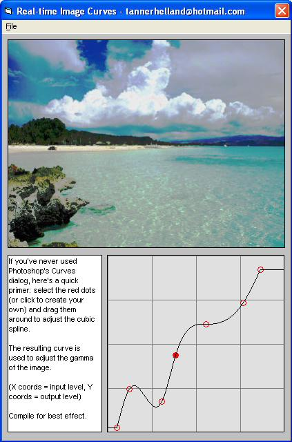



## Real\-time Image Curves \(using cubic splines\) \- just like Photoshop

### Description

By request, here's another first of its kind in VB: a fast, accurate, real-time image curves dialog. (This should be familiar to the PhotoShop users among us :) Curves is similar in theory to my previous "Image Levels" post and standard gamma correction, but it provides a much more powerful interface for adjusting the luminance of an image. This project provides results very similar to Photoshop's, and it allows the creation of more spline knots (32 instead of 16). The cubic spline code on which I based my code was taken from Jason Bullen's excellent "Simple Cubic Spline Curve Plot" (http://www.planetsourcecode.com/vb/scripts/ShowCode.asp?txtCodeId=11488&amp;lngWId=1).

The code is well-commented and very fast - please post comments, requests for future Photoshop-related code, and many heaps of praise (as this was a complicated routine to sort out...)! Update 2/May/07 - disable loading of icons and warn the user against loading very large images.
 
### More Info
 

             |
---                |---
**Submitted On**   |2007-06-02 15:13:02
**By**             |[Tanner H](https://github.com/Planet-Source-Code/PSCIndex/blob/master/ByAuthor/tanner-h.md)
**Level**          |Intermediate
**User Rating**    |5.0 (85 globes from 17 users)
**Compatibility**  |VB 5\.0, VB 6\.0
**Category**       |[Graphics](https://github.com/Planet-Source-Code/PSCIndex/blob/master/ByCategory/graphics__1-46.md)
**World**          |[Visual Basic](https://github.com/Planet-Source-Code/PSCIndex/blob/master/ByWorld/visual-basic.md)
**Archive File**   |[Real\-time\_206881622007\.zip](https://github.com/Planet-Source-Code/tanner-h-real-time-image-curves-using-cubic-splines-just-like-photoshop__1-68577/archive/master.zip)

### API Declarations

DIB sections

